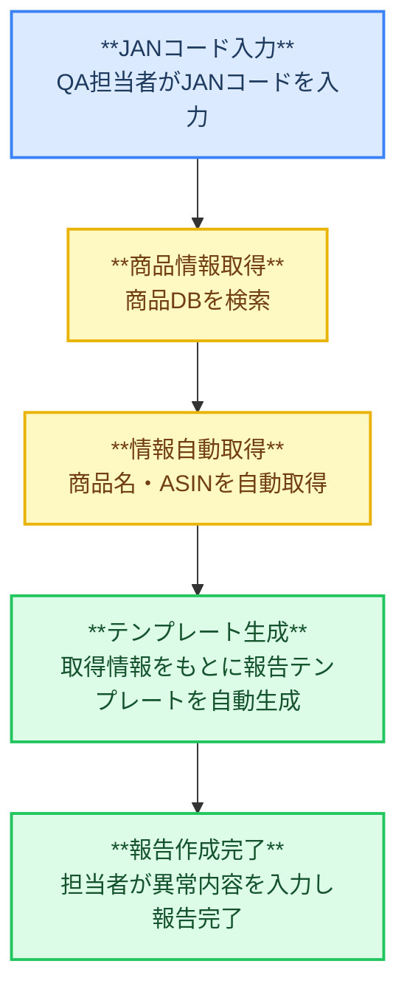

# QA支援ツール

## 概要

品質管理業務における報告作成を効率化するために開発した支援ツール。  
JANコードを入力するだけで商品名・ASINを自動取得し、報告テンプレートを生成することで、入力ミス防止と報告品質の標準化を実現した。

---

## 開発背景

品質管理業務では商品の不具合や異常を報告する際に、業務システムで商品情報を検索し手動でコピペしながら報告書を作成していた。  
そのため、商品情報の入力ミスや商品取り違え、報告内容のばらつきが発生しやすく、作業者の経験に依存していた。  
そこで、JANコードを起点に必要情報を自動取得し、誰でも同じ品質で報告できる仕組みを構築した。

---

## 課題

- 商品名やASINを業務システムで都度検索し、手動でコピペする必要があった
- 入力ミスや商品取り違えが発生するリスクがあった
- 報告内容や記載形式にばらつきがあった
- 作業者の経験によって報告品質が左右されていた

---

## 実装内容

### 商品情報自動取得

JANコードを入力すると、商品DBから商品名・ASINを自動取得し、報告に必要な情報を自動反映する。

### QA報告テンプレート生成

取得した商品情報をもとに報告テンプレートを自動生成。

### 入力補助機能

入力必須項目を整理し、記入漏れを防止。

### 報告形式の標準化

誰が作成しても同じ形式で報告できるようテンプレート化した。

---

## 使用技術

| 技術 | 用途 |
|------|------|
| Google Apps Script (GAS) | バックエンド処理・自動化 |
| Google Spreadsheet | データ管理・出力・商品DB |
| FILTER関数 / Spreadsheet関数 | 商品情報検索・テンプレート生成 |

**使用関数**  
`IF` `ARRAYFORMULA` `COUNTIF` `VSTACK` `FILTER`

---

## 処理フロー

---

## 効果

### 作業効率向上

- 商品情報の検索・転記作業を削減
- JAN入力のみで報告作成に必要な情報を取得可能にした

### 品質向上

- 商品情報の転記ミス防止
- 表記揺れ防止
- 入力漏れ防止
- 報告形式の統一

### 利用状況

- QA担当者の日常業務で継続利用
- 千葉拠点へ展開し運用定着

---

## 担当範囲

課題発見から設計、開発、運用まで一貫して担当。

---

## 工夫した点

- JANコードを起点に商品情報を自動取得し、手動コピペによる入力ミスを排除した
- 報告テンプレートを自動生成し、記載内容のばらつきを抑制した
- 報告に慣れていない担当者でも利用できるよう操作を簡略化し、業務標準化を実現した
